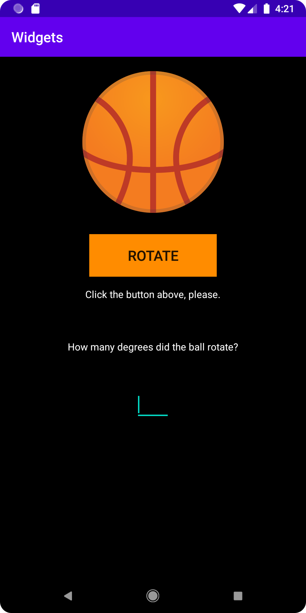

# Rapport

Changed the default-layout from ConstraintLayout to LinearLayout.
I added four different widgets in main.xml, such as TextView, Button, ImageView and EditText.

I also added some form of interaction within the application in form of this function below.
Which makes the basketball to rotate 180 degrees once, when the button is clicked.

```
public void onClick(View view) {
    ImageView image = (ImageView) findViewById(R.id.ball);
    image.setRotation(180);
}
```
To achieve a clean and structured visualization, but also change the original position of the widget
when it first appeared. I used:
```
android:layout_gravity="center_vertical|center_horizontal"
android:layout_margin="(insertDesiredDP)"
```

# Screenshot


